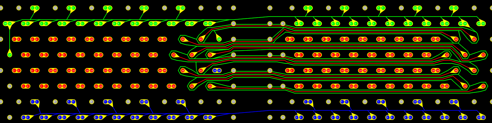
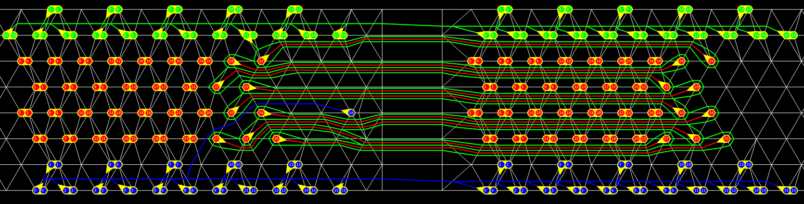
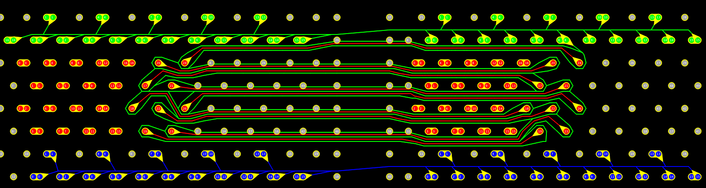
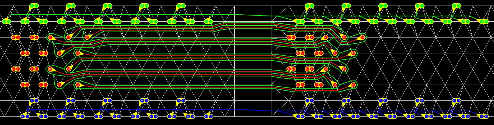
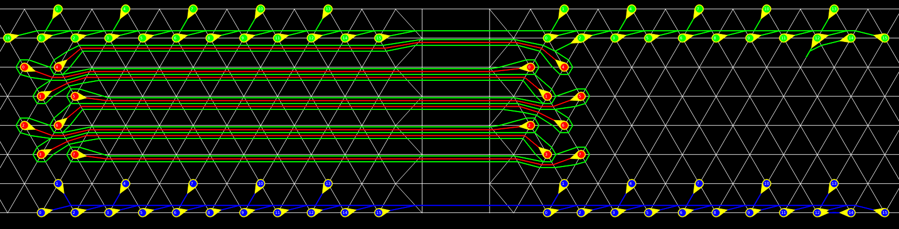

        
## Install Packages
### CGAL & Qt5
```bash
sudo apt update
sudo apt install libcgal-dev libcgal-qt5-dev
```
### Boost 1.80.0
```bash
cd ~
wget https://archives.boost.io/release/1.80.0/source/boost_1_80_0.tar.gz
tar -xvzf boost_1_80_0.tar.gz
cd boost_1_80_0
mkdir -p ~/myPackage/boost_1_80_0
./bootstrap.sh --prefix=$HOME/myPackage/boost_1_80_0
./b2 install --prefix=$HOME/myPackage/boost_1_80_0
```

## Set Environment Variable
```bash
vim ~/.bashrc
export BOOST_ROOT=$HOME/myPackage/boost_1_80_0
export LD_LIBRARY_PATH=$HOME/myPackage/boost_1_80_0/lib:$LD_LIBRARY_PATH
export CPATH=$HOME/myPackage/boost_1_80_0/include:$CPATH
export PATH=$HOME/myPackage/boost_1_80_0/bin:$PATH
source ~/.bashrc
ls $BOOST_ROOT/include/boost
ls $BOOST_ROOT/lib
```

## Compile
```bash
cmake .
make
# Generate executables, D2D and D2D_Gui, in ./bin
```
## Usage 

### D2D
Generates routing results based on design rules and initial bump positions.
```bash
./D2D design_file design_rule result_folder [-p population_size] [-g number_of_generations] [-c crossover_rate] [-m mutation_rate]  [-s seed]
```
**Required Parameters:**
- `design_file`: Data for initial bump locations.
- `design_rule`: Design rules and constraints.
- `result_folder`: Target folder for output results.

**Optional Parameters:**
- `seed`: Random seed for reproducibility.

**Global Routing (Genetic Algorithm Settings):**
- `population_size`: Number of individuals in the population.
- `number_of_generations`: Total number of iterations.
- `crossover_rate`: Probability of crossover.
- `mutation_rate`: Probability of mutation.
        
EX:
```bash
./bin/D2D testcase/standard_44/bumps.loc testcase/standard_44/rule.txt ./result -p 300 -g 100 -m 0.1 -c 0.9 -s 100
```

### D2D_Gui 
D2D_Gui will show the results based on design rules and results from D2D.
```bash
./D2D_Gui executable design_file design_rule result_folder 
```
**Required Parameters:**
- `executable`: Data for initial bump locations.
- `design_file`: Design file contains initial bump positions.
- `design_rule`: Design rules and constraints.
- `result_folder`: Result folder of the design file.

EX:
```bash
./bin/D2D_Gui ./bin/D2D ./testcase/standard_44/bumps.loc ./testcase/standard_44/rule.txt ./result/
```

## Routing Result on Standard Case
- 🔴 **Red bump/net for signal**
- 🟢 **Greenbump/net for VSS (ground)**
- 🔵 **Blue bump/net for VDD (source)**
#### Layer1

#### Layer2

#### Layer3

#### Layer4

#### Layer5
